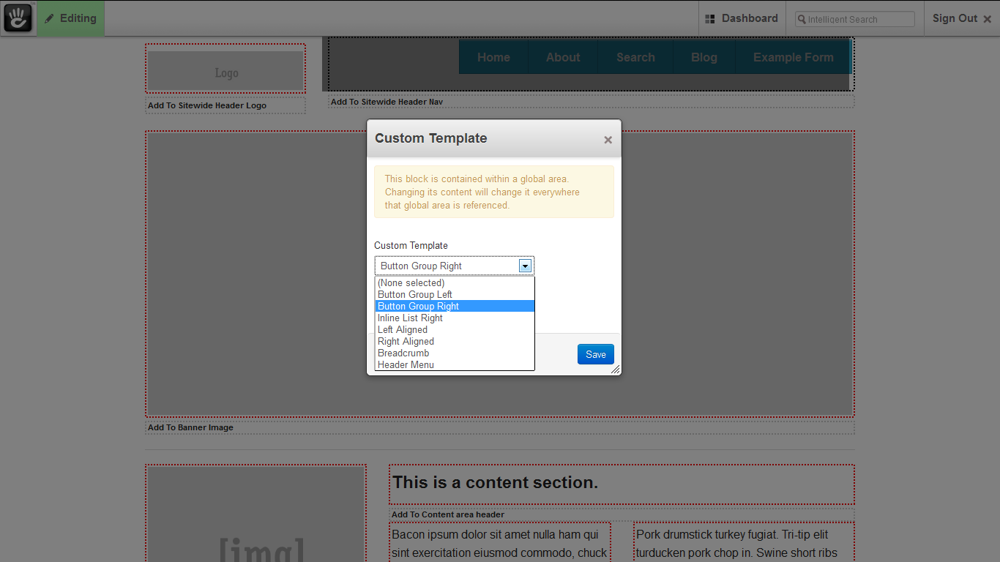
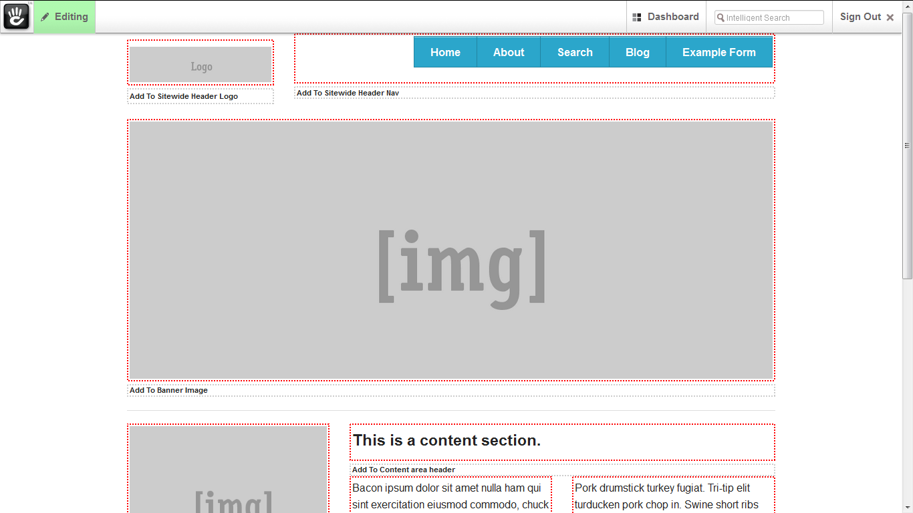
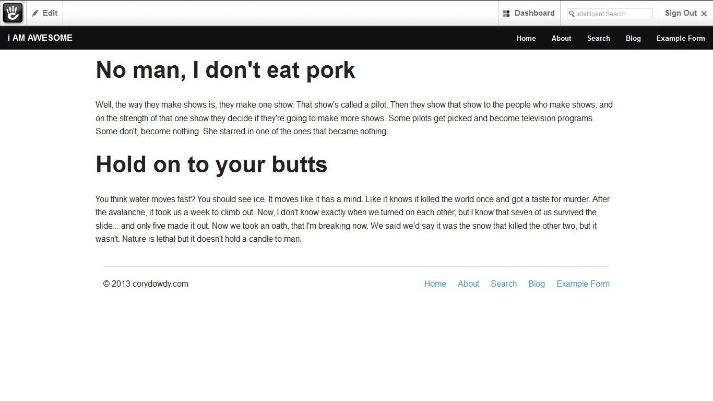
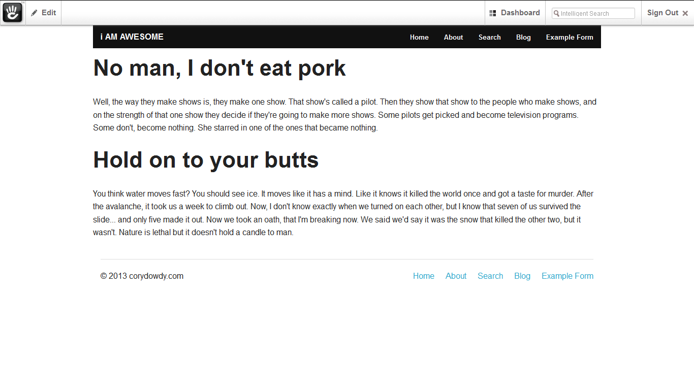

concrete5-Foundation4.3.2-theme
===============================

Concrete5 Foundation 4.3.2 responsive theme.  

includes: one basic page with editable content areas and navigation templates. 

- top bar navigation
- full-width topbar
- button groups left and right
- inline lists left and right
- empty page template
- topbar template

**very much beta/alpha**.  there are some edit mode clashes (nothing big just slow to load) I'll fix all these when I have time 
and only if I don't move on to foundation 5 before hand.  Also only one template/page type is fully editable the rest
just have one content area to add too. ooooo and the topbar dropdown is wonky. 

sample screenie  

**Nav Templates**
  
**Button Group Right**
  
**Full Width Top Bar**
  
**Contain to grid Top-bar**

